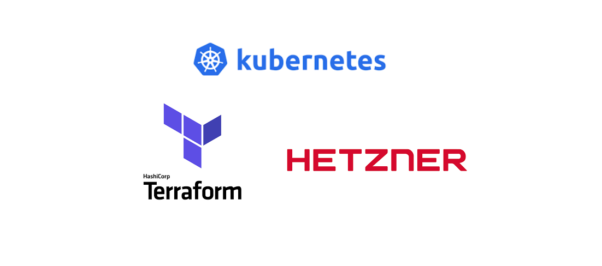
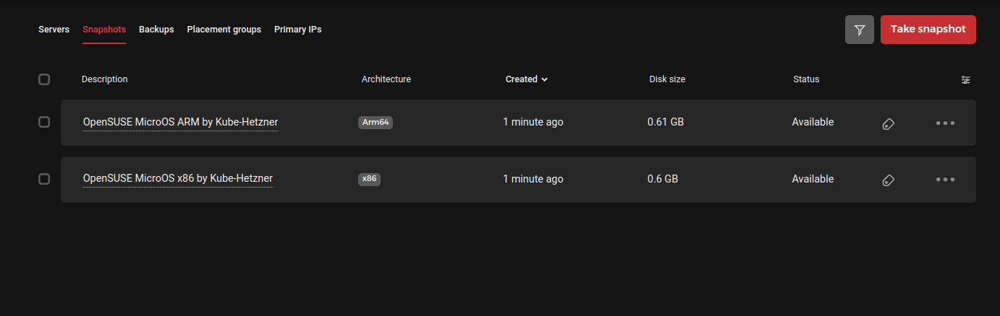
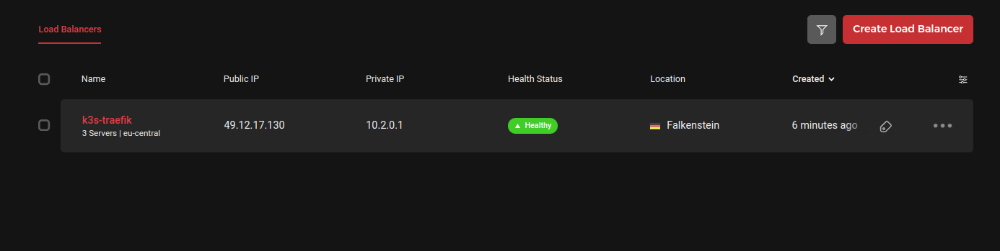
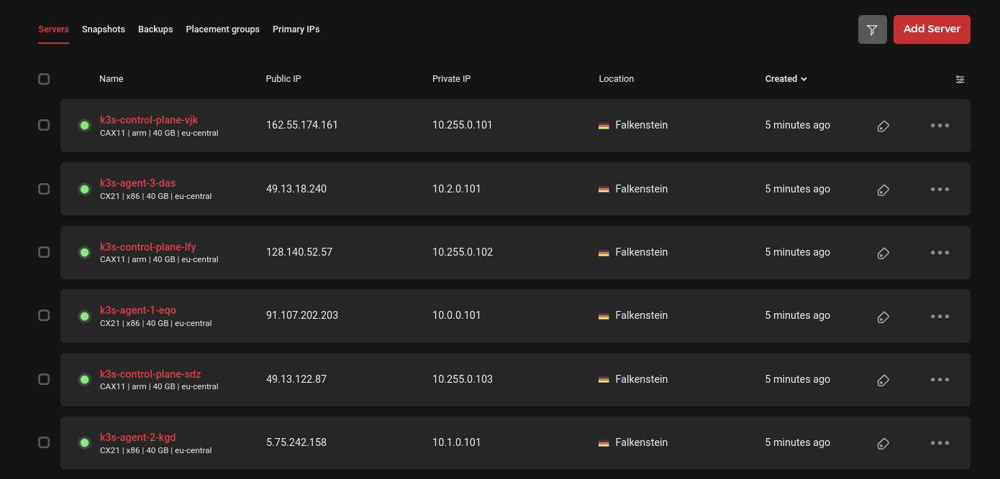
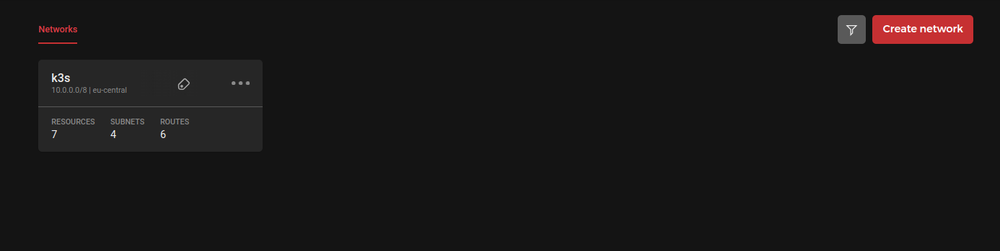
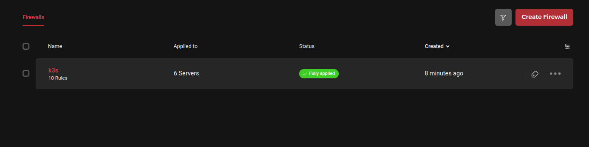
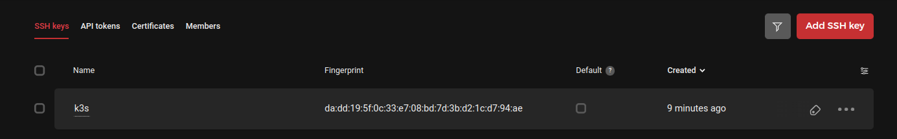

# Terraform



## Kube-Hetzner

- This template was created from [kube-hetzner](https://github.com/kube-hetzner/terraform-hcloud-kube-hetzner/blob/master/kube.tf.example) library.
- Which packages will be installed ? :
  - [Longhorn](https://longhorn.io/) as storage manager
  - [Traefik](https://traefik.io/)
  - [MongoDB](https://www.mongodb.com/) and [RabitMQ](https://rabbitmq.com/)
  - [ArgoCD](https://argo-cd.readthedocs.io/en/stable/) as GitOps continuous delivery tool
  - [Prometheus](https://prometheus.io/) and [Grafana](https://grafana.com/) for collecting metrics and monitoring

## How to use this template

1- Create an account inside the hetzner cloud and obtain a token
2- Save two iso images (x86 and arm64) into the hetzner snapshot servers. You must run this step just one time.

```bash
tmp_script=$(mktemp) && curl -sSL -o "${tmp_script}" https://raw.githubusercontent.com/kube-hetzner/terraform-hcloud-kube-hetzner/master/scripts/create.sh && chmod +x "${tmp_script}" && "${tmp_script}" && rm "${tmp_script}"

# 1 Hit the enter key
# Enter the name of the folder you want to create (leave empty to use the current directory instead, useful for upgrades):

# 2
# kube.tf already exists. Skipping download.

# The snapshots are required and deployed using packer. If you need specific extra packages, you need to choose no and edit hcloud-microos-snapshots.pkr.hcl file manually. This is not needed in 99% of cases, as we already include the most common packages.

# Do you want to create the MicroOS snapshots (we create one for x86 and one for ARM architectures) with packer now? (yes/no):

# 3
# Enter your HCLOUD_TOKEN:

# 4
# ==> Wait completed after 6 minutes 32 seconds

# ==> Builds finished. The artifacts of successful builds are:
# --> hcloud.microos-x86-snapshot: A snapshot was created: 'OpenSUSE MicroOS x86 by Kube-Hetzner' (ID: 147349134)
# --> hcloud.microos-arm-snapshot: A snapshot was created: 'OpenSUSE MicroOS ARM by Kube-Hetzner' (ID: 147349328)

# Remember, don't skip the hcloud cli, to activate it run 'hcloud context create <project-name>'. It is ideal to quickly debug and allows targeted cleanup when needed!

# Before running 'terraform apply', go through the kube.tf file and fill it with your desired values.
```

{ width=50% }

3- Create an ed25519 ssh key

```bash
ssh-keygen -t ed25519  -f ~/.ssh/id_ed25519_terraform_hetzner_cloud
```

4- Create terraform.tfvars file and fill in the varibales as follow (hcloud and iso_snapshots image ids are important)

```env
hcloud_token                 = "hcloud_token obtained in the first step"
microos_x86_snapshot_id      = "147349134"
microos_arm_snapshot_id      = "147349328"
argocd_admin_password        = "changeme"
mongodb_root_password        = "changeme"
rabbitmq_admin_password      = "changeme"
rabbitmq_storageclass_name   = "longhorn"
rabbitmq_storage_size        = "2Gi"
mongodb_storageclass_name    = "longhorn"
mongodb_storage_size         = "2Gi"
prometheus_storageclass_name = "longhorn"
prometheus_storage_size      = "2Gi"
grafana_storageclass_name    = "longhorn"
grafana_storage_size         = "2Gi"
grafana_admin_password       = "changeme"
traefik_hostname             = "traefik.example.com"
longhorn_hostname            = "longhorn.example.com"
argocd_hostname              = "argocd.example.com"
prometheus_hostname          = "prometheus.example.com"
```

5- Now you can edit kube.tf and other files and then make k3s instance

```bash
terraform init
terraform apply
```

## The resources will be created

- Load Balancer:
  { width=50% }
- Servers:
  { width=50% }
- Network:
  { width=50% }
- Firewal:
  { width=50% }
- SSH Key:
  { width=50% }

## Get Argocd Password

```bash
kubectl -n argocd get secret argocd-initial-admin-secret -o jsonpath="{.data.password}" --kubeconfig=k3s_kubeconfig.yaml | base64 -d
```

## Kubectl

```bash
kubectl get namespaces --kubeconfig=k3s_kubeconfig.yaml
kubectl get nodes --kubeconfig=k3s_kubeconfig.yaml
```

## K3S Debug

```bash
ssh root@nodeip -i ~/.ssh/id_ed25519_terraform_hetzner_cloud -o StrictHostKeyChecking=no -p 2220

journalctl -u k3s
journalctl -u k3s-agent
```

## Database

- Connect with running mongodb-client inside the cluster

```bash
export MONGODB_ROOT_PASSWORD=$(kubectl get secret --kubeconfig=k3s_kubeconfig.yaml --namespace mongodb mongodb -o jsonpath="{.data.mongodb-root-password}" | base64 -d)

kubectl run --kubeconfig=k3s_kubeconfig.yaml --namespace mongodb mongodb-client --rm --tty -i --restart='Never' --env="MONGODB_ROOT_PASSWORD=$MONGODB_ROOT_PASSWORD" --image docker.io/bitnami/mongodb:7.0.4-debian-11-r4 --overrides='{"apiVersion": "v1", "spec": {"nodeSelector": { "run": "packages" }}}' --command -- bash

export MONGODB_ROOT_USER=root

mongosh admin --host "mongodb-0.mongodb-headless.mongodb.svc.cluster.local:27017,mongodb-1.mongodb-headless.mongodb.svc.cluster.local:27017" --authenticationDatabase admin -u $MONGODB_ROOT_USER -p $MONGODB_ROOT_PASSWORD
```

## Grafana

Prometheus service address for adding inside the grafana data source:

```
http://prometheus-server.prometheus.svc.cluster.local
```

## ArgoCD Image Update logs

```bash
kubectl logs -f -l app.kubernetes.io/instance=argocd-image-updater -n argocd --kubeconfig=k3s_kubeconfig.yaml
```
